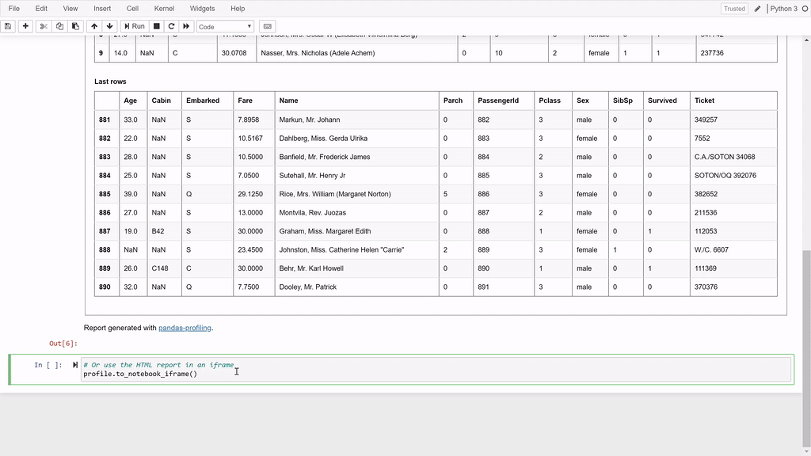
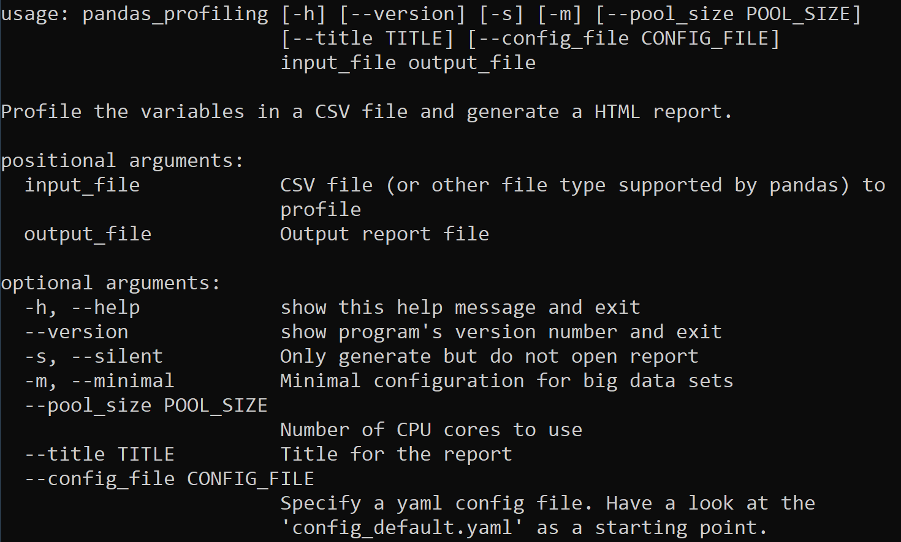

# Quickstart

Start by loading your pandas `DataFrame` as you normally would, e.g. by
using:

``` python
import numpy as np
import pandas as pd
from ydata_profiling import ProfileReport

df = pd.DataFrame(np.random.rand(100, 5), columns=["a", "b", "c", "d", "e"])
```

To generate the standard profiling report, merely run:

``` python
profile = ProfileReport(df, title="Pandas Profiling Report")
```

## Using inside Jupyter Notebooks

There are two interfaces to consume the report inside a Jupyter notebook
(see animations below): through widgets and through an embedded HTML
report.


This is achieved by simply displaying the report as a set of widgets. In
a Jupyter Notebook, run:

``` python
profile.to_widgets()
```

The HTML report can be directly embedded in a cell in a similar fashion:

``` python
profile.to_notebook_iframe()
```



## Exporting the report to a file

To generate a HTML report file, save the `ProfileReport` to an object
and use the `to_file()` function:

``` python
profile.to_file("your_report.html")
```

Alternatively, the report\'s data can be obtained as a JSON file:

``` python
# As a JSON string
json_data = profile.to_json()

# As a file
profile.to_file("your_report.json")
```

## Command line usage

For standard formatted CSV files (which can be read directly by pandas
without additional settings), the `ydata_profiling` executable can be
used in the command line. The example below generates a report named
*Example Profiling Report*, using a configuration file called
`default.yaml`, in the file `report.html` by processing a `data.csv`
dataset.

``` bash
ydata_profiling --title "Example Profiling Report" --config_file default.yaml data.csv report.html
```

Information about all available options and arguments can be viewed
through the command below. The CLI allows defining input and output
filenames, setting a custom report title, specifying
`a configuration file for custom behaviour <../advanced_usage/changing_settings>`{.interpreted-text
role="doc"} and control other advanced aspects of the experience.

``` bash
ydata_profiling -h
```
<figure markdown>
  {width="500"}
  <figcaption>Options available in the CLI</figcaption>
</figure>

## Deeper profiling

The contents, behaviour and appearance of the report are easily
customizable. The example below used the explorative mode, a lightweight
data profiling option.

``` python
profile = ProfileReport(df, title="Profiling Report", explorative=True)
```

On the CLI utility `ydata_profiling`, this mode can be activated with
the `-e` flag. Learn more about configuring `ydata-profiling` on the
`../advanced_usage/available_settings`{.interpreted-text role="doc"}.
